# 📸 Instagram Clone – Full Stack Social Media Platform


---

## 🌟 Overview

A production-ready **Instagram-like social media platform** built using **React (TypeScript)** and **Spring Boot**, implementing real-world features like authentication, media sharing, social interactions, search, trending content, and backend fault tolerance.

---

## 🚀 Key Highlights

* Full-stack application with **React + Spring Boot**
* **Secure authentication system** with validation & password reset
* **Multi-media posts** (images, videos, multi-image carousel, camera capture)
* **Social features**: likes, comments, follow/unfollow
* **Search system**: users & hashtags with filtering
* **Trending module** for discovering popular content
* **Notification system (non real-time)** for user actions
* **Resilience4j Circuit Breaker** for login failure handling
* Clean, scalable architecture using layered design

---

## 🧱 Architecture Diagram

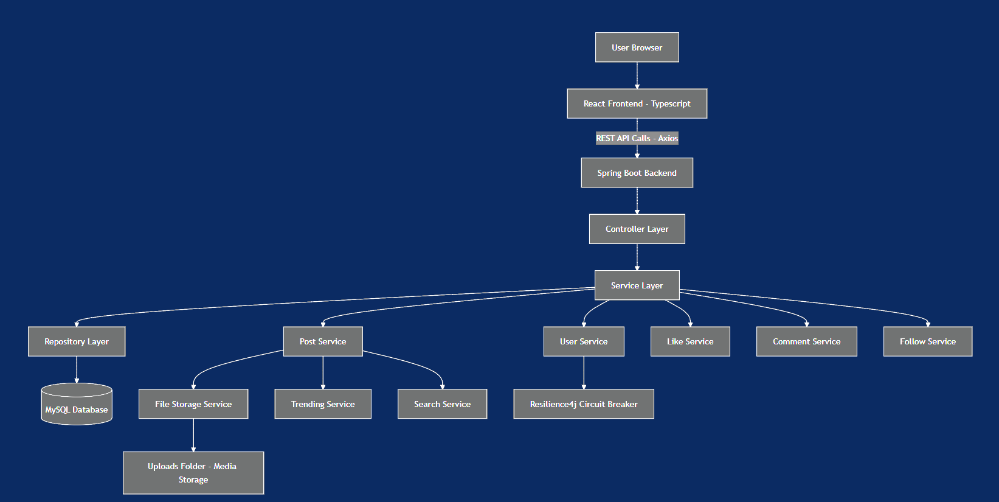

---

## 🛠️ Tech Stack

### 🔹 Frontend

* React 18
* TypeScript
* React Router
* Axios
* Bootstrap

### 🔹 Backend

* Spring Boot
* Spring Data JPA
* Hibernate
* Maven
* Resilience4j
* Lombok

### 🔹 Database

* MySQL

---

## 📸 Screenshots


### 🚀 Application Landing Page


---

### 🔐 Authentication

| Register                                | Login                             |
| --------------------------------------- | --------------------------------- |
| 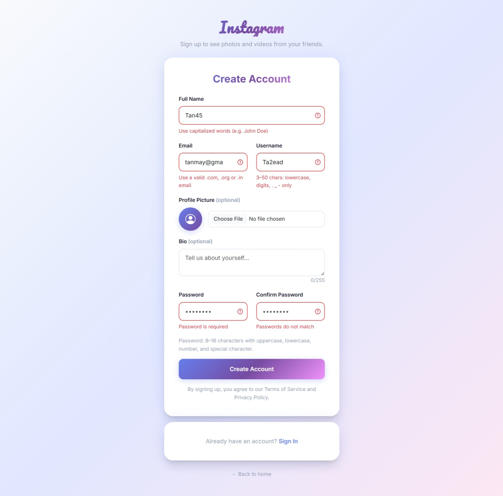 | 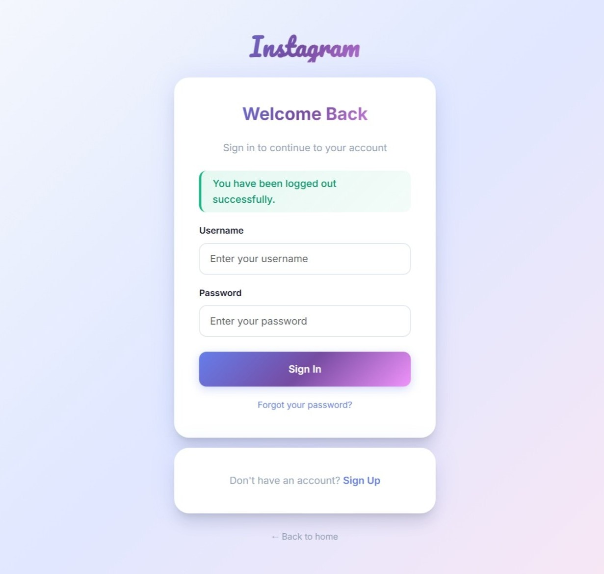 |

---

### 🏠 Home Feed

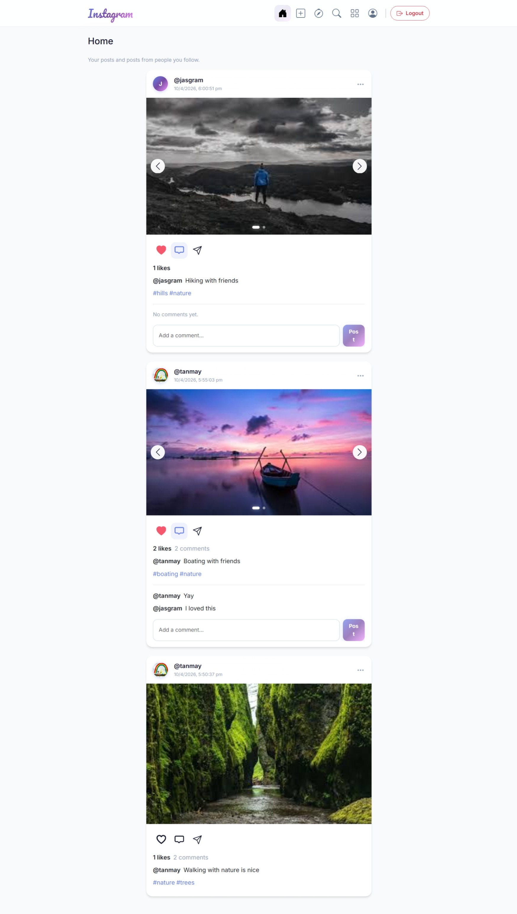

---

### 📝 Create Post

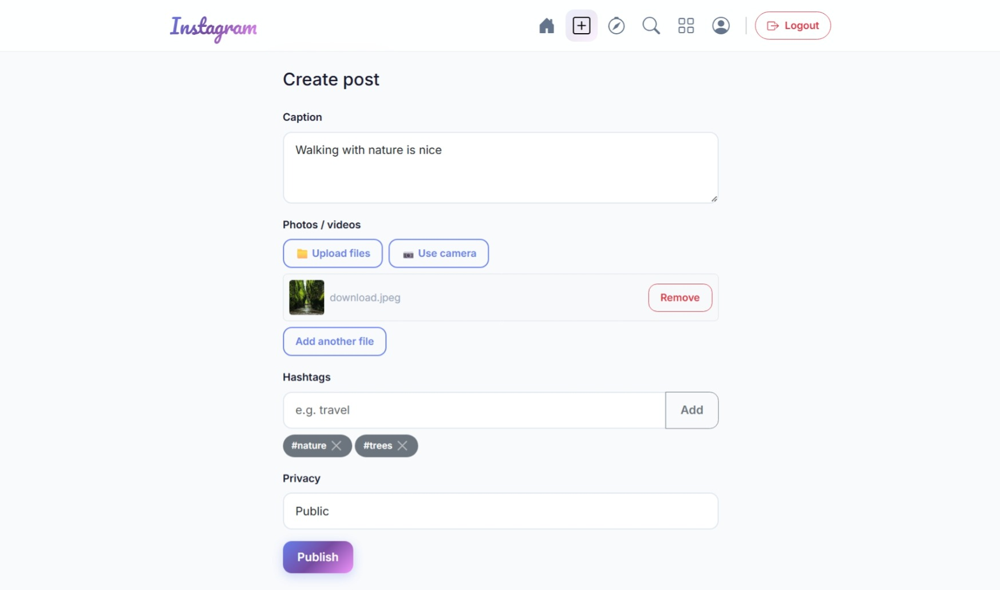

---

### 🎥 Media Support

| Multi Image                  | Video                        | Camera                        |
| ---------------------------- | ---------------------------- | ----------------------------- |
|  | 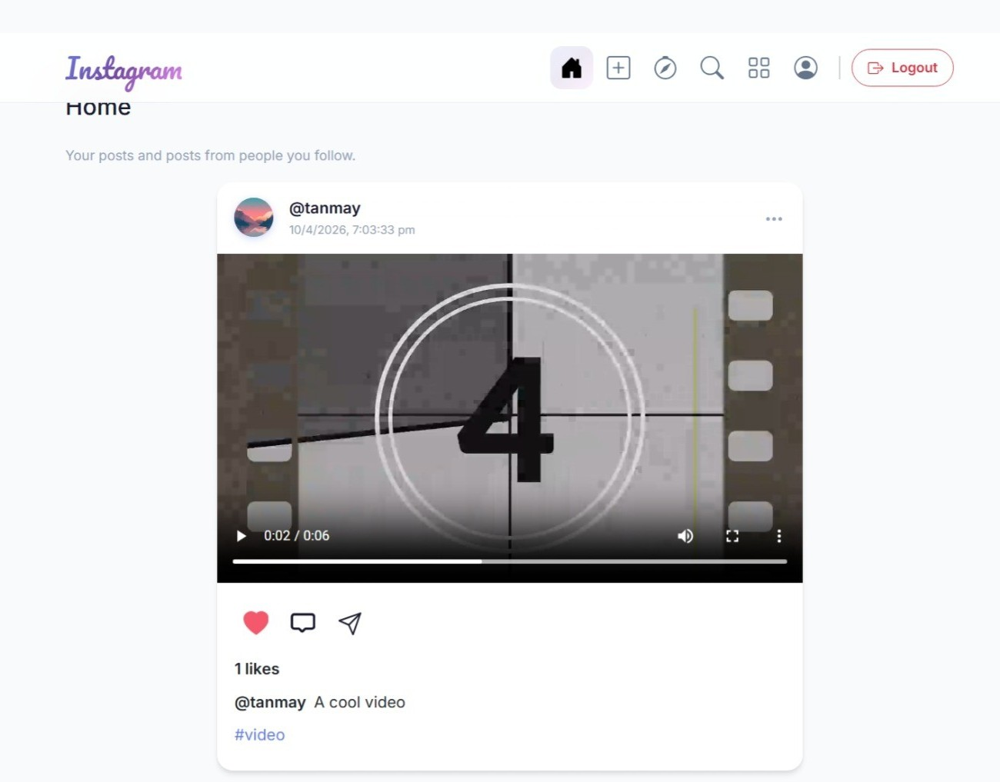 | 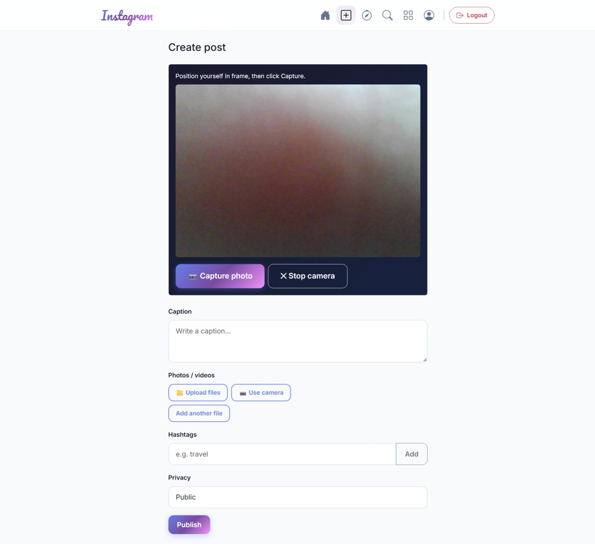 |

---

### 👤 User Profile

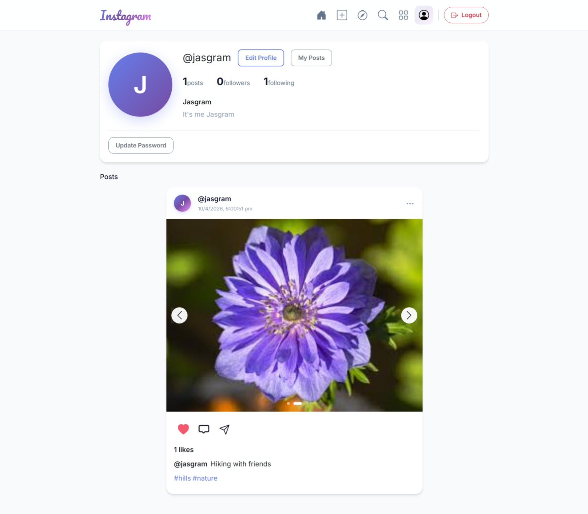

---

## ✏️ Edit Profile

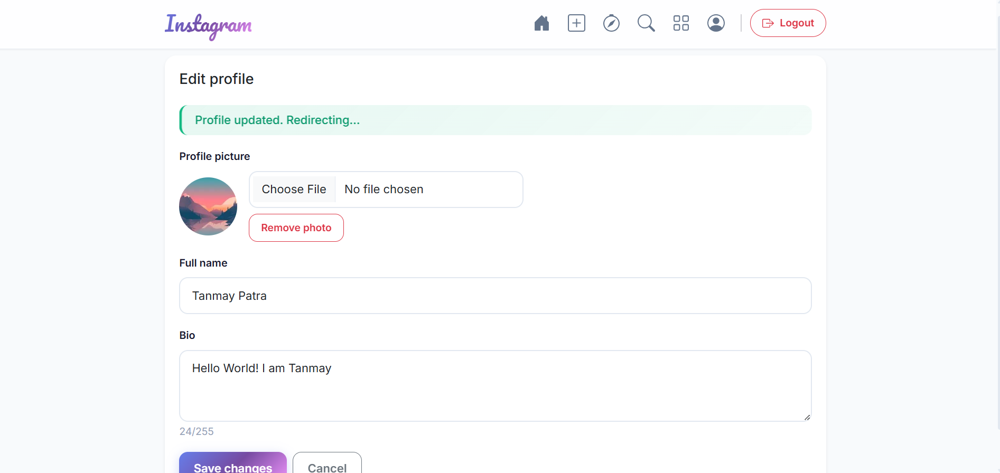

---

### 💬 Comments

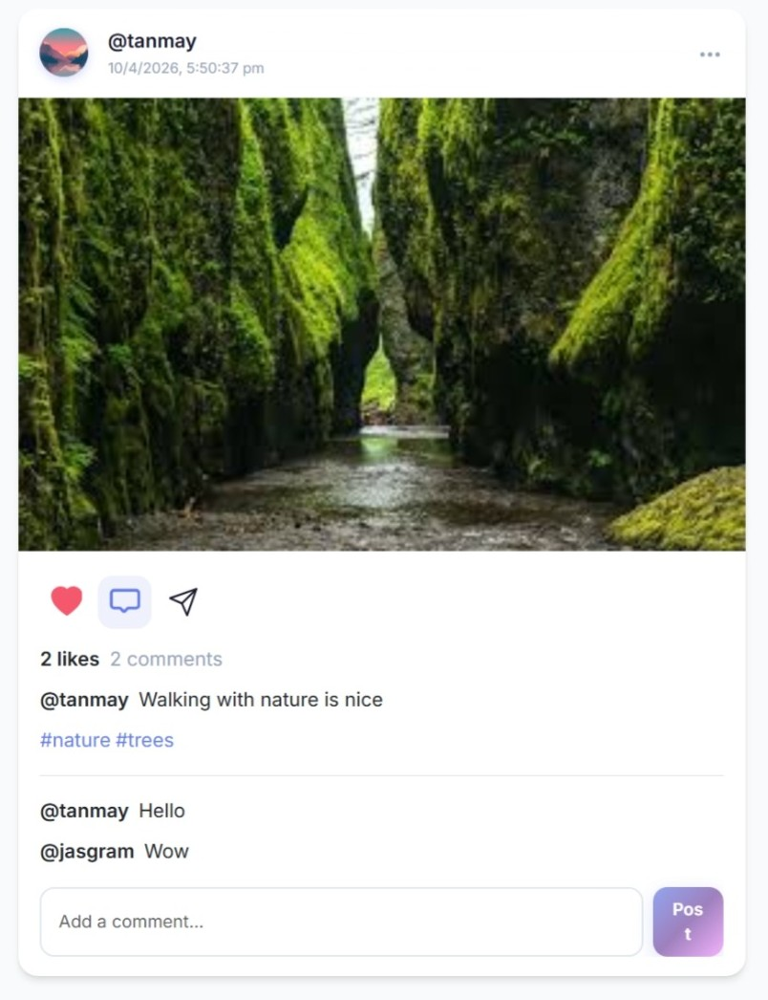

---

### 🔍 Search & Explore

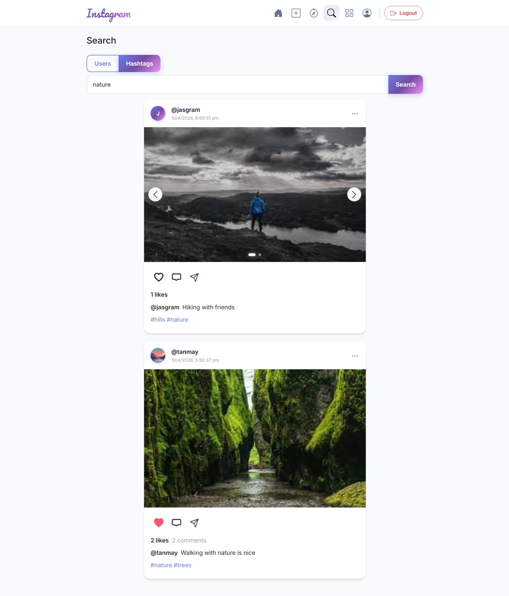

---

### 📈 Trending

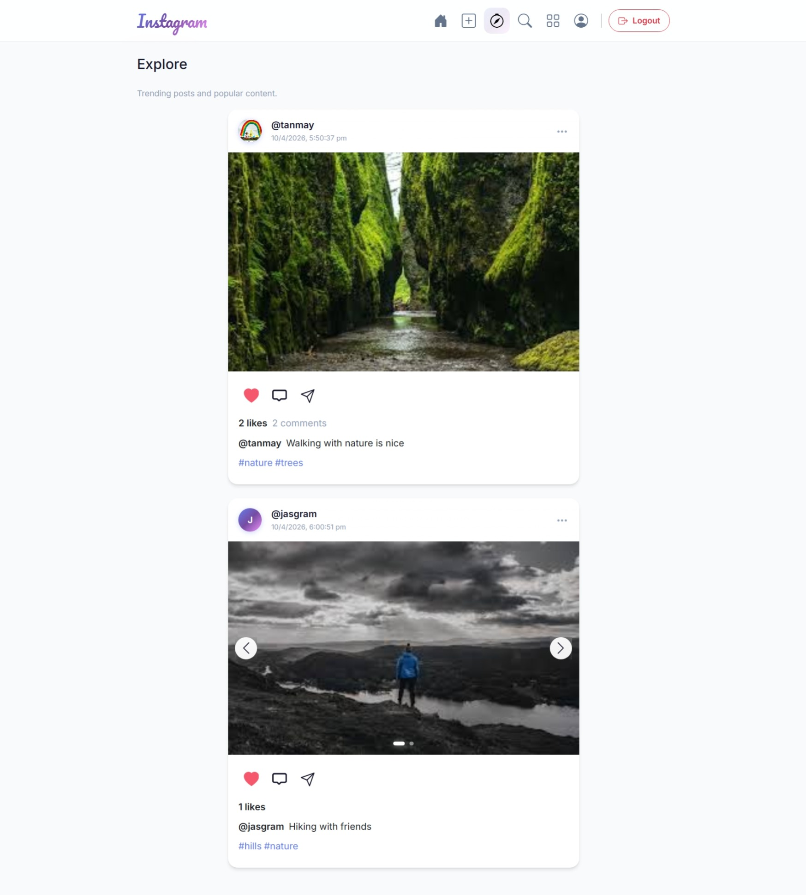

---

## ⚙️ Setup Instructions

### 1️⃣ Clone Repository

```bash
git clone https://github.com/Tanmay-Patra/react-springboot-social-platform.git
cd react-springboot-social-platform
```

---

## 🔧 Backend Setup

### Prerequisites

* Java 21+
* Maven
* MySQL

```bash
cd backend
```

Update `application.properties`:

```properties
spring.datasource.url=jdbc:mysql://localhost:3306/your_database_name
spring.datasource.username=your_username
spring.datasource.password=your_password
```

Run:

```bash
mvn spring-boot:run
```

---

## 🎨 Frontend Setup

```bash
cd frontend
npm install
npm start
```

Create `.env`:

```env
REACT_APP_API_BASE=http://localhost:8080
```

---

## ⚙️ Core Features

### 👤 Authentication

* User registration with strict validations
* Secure login system
* Password reset via email verification

---

### 📝 Post System

* Create posts with:

  * Images
  * Videos
  * Multiple images (carousel)
  * Camera capture
* Add captions, hashtags, descriptions
* Privacy settings (public/friends/private)

---

### ❤️ Social Features

* Like / Unlike posts
* Comment on posts
* View comments
* Follow / Unfollow users

---

### 🔔 Notifications

* Triggered on:

  * User registration & loggin
  * Post creation & deletion
  * Logout
  * Following & Unfollowing
  * Reset & forgot password
* Non real-time (API-based feedback system)

---

### 🔍 Search

* Search users and hashtags
* Filter and sort results
* Navigate to profiles/posts

---

### 📈 Trending

* Explore popular posts & hashtags
* Sorted by engagement and recency

---

### 🗑️ Post Management

* Delete posts with confirmation
* Permanent deletion with cleanup of interactions

---

### ⚡ Fault Tolerance

* Resilience4j Circuit Breaker
* Activates after 5 failed login attempts
* Blocks login for 1 minute with timer

---

## 📡 API Overview

### Auth APIs

* `POST /api/auth/register`
* `POST /api/auth/login`
* `POST /api/auth/password/reset-request`
* `POST /api/auth/password/reset`

### Post APIs

* `POST /api/posts/{userId}`
* `GET /api/posts/feed/{userId}`
* `GET /api/posts/trending`
* `DELETE /api/posts/{userId}/{postId}`

---

## 💡 What This Project Demonstrates

* Full-stack development (React + Spring Boot)
* Real-world user stories implementation
* Media handling in web apps
* Scalable backend architecture
* Fault-tolerant systems using circuit breakers

---

## 🔮 Future Enhancements

* WebSockets for real-time notifications
* JWT-based authentication
* Comment threads
* Chat system
* Cloud storage (AWS S3 / Cloudinary)

---
